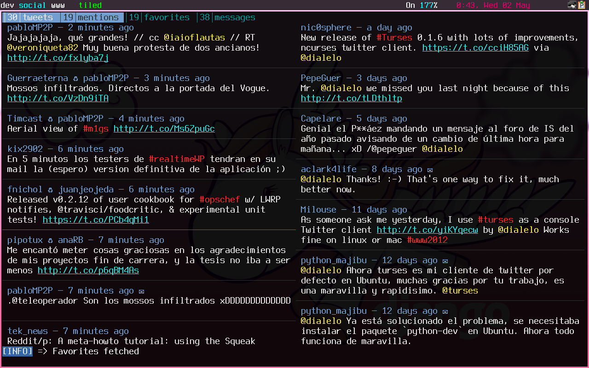

turses
======

A Twitter client for the console.

A session with multiple columns running on ``urxvt``:

The goal of the project is to build a full-featured, lightweight, and extremely
configurable Twitter client.

Documentation
-------------

The documentation for ``turses`` is `available on ReadTheDocs
<https://turses.readthedocs.org>`_.

Take a look at `this screencast
<https://www.youtube.com/watch?v=kmnEdldw7WY>`_ for an
overview of the features of ``turses`` and its usage.

Installation
------------

If you downloaded the source code ::

    $ python setup.py install

With ``pip`` ::

    $ pip install turses

or (but `consider using pip`_):  ::

    $ easy_install turses

.. _`consider using pip`: https://www.pip-installer.org/en/latest/other-tools.html#pip-compared-to-easy-install

Features
--------

- Multiple timelines (buffers)
- Multi-column
- Tweet, Reply, Retweet, Delete tweet
- Follow/Unfollow
- Favorite/Unfavorite
- Direct Messages
- Open URLs in browser
- Thread view
- Unread count
- Search
- View any user's tweets
- Fully customizable
- Multiple accounts

Development
-----------

The code is hosted on a `git repo`_.

.. _`git repo`: https://github.com/louipc/turses

A list of tasks can be found on the on the `issue tracker`_. Feel free to
submit issues, feature requests or participate in ongoing discussions.

.. _`issue tracker`: https://github.com/louipc/turses/issues

If you feel hackish, reading the `dev docs`_ is recommended.

.. _`dev docs`: https://turses.readthedocs.org/en/latest/dev/internals.html

``CONTRIBUTING.md`` contains instructions on how to contribute code.

Roadmap
-------

- Lists
- Streaming
- Notifications

License
-------

``turses`` is licensed under a GPLv3 license, see ``LICENSE`` for details.

Authors
-------

``turses`` is based on `Tyrs`_ by `Nicolas Paris`_.

.. _`Tyrs`: https://github.com/Nic0/tyrs
.. _`Nicolas Paris`: https://github.com/Nic0

See ``AUTHORS`` for a full list of contributors.
