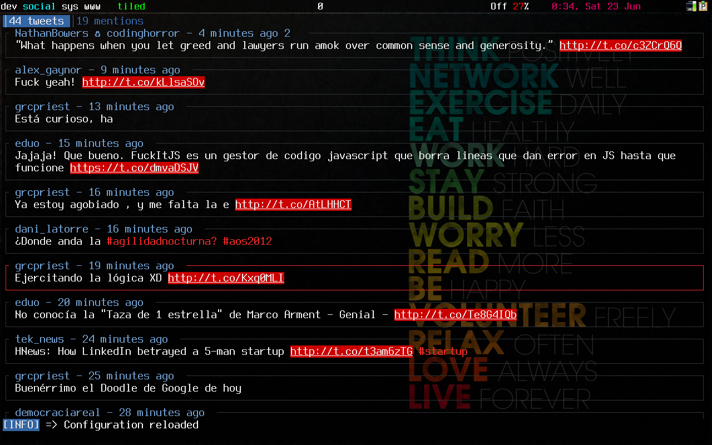
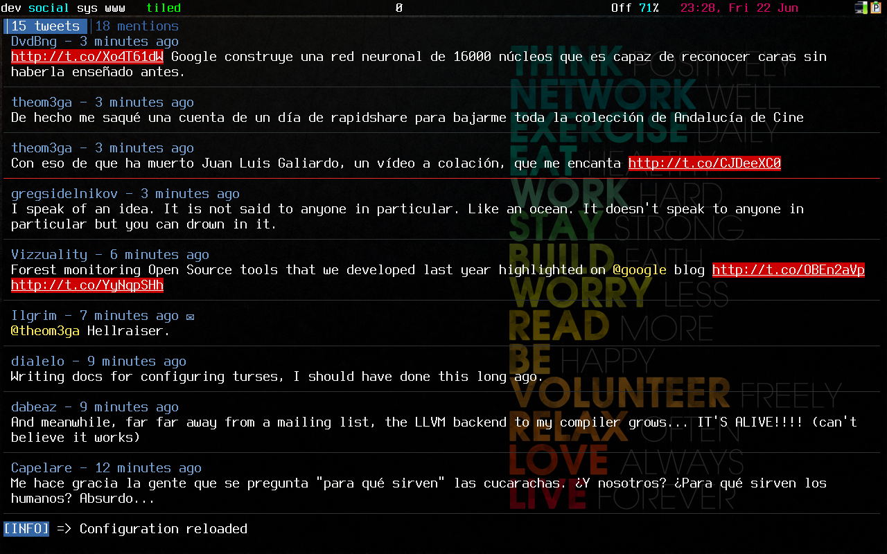
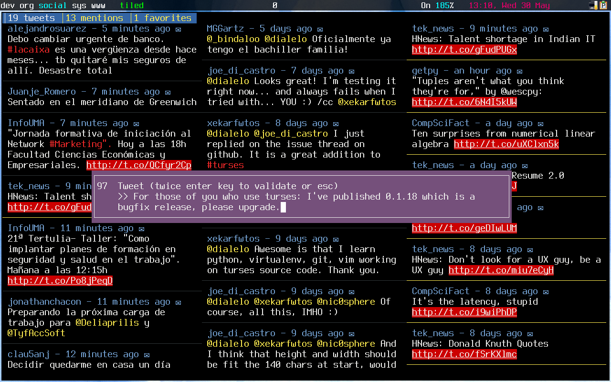

Configuration
=============

.. automodule:: turses.config

The configuration file is divided into sections, each of which is described
below these lines.

.. warning:: The ``timelines`` section of the configuration has been
   deprecated, use sessions instead.

Sessions
--------

.. automodule:: turses.session

Twitter
-------

This section allows you to configure the settings related to the Twitter API.

``turses`` communicates with Twitter over HTTPS by default but you can switch
it off if you set it to false:

::
    [twitter]
    use_https = false

However, we recommend you to use HTTPS, especially in open WiFi networks where
anybody could be sniffing packages and reading your personal information and
communications.

The other available option is ``update_frequency`` which controls how often (in
seconds) the timelines should be automatically updated.

An example configuration that updates the timelines every minute:

::

    [twitter]
    update_frequency = 60

Bindings
--------

Almost every action within ``turses`` is configurable. The defaults resemble
some of the bindings from the ``vi`` editor. To see an up-to-date description
of all the available actions open the help buffer pressing ``?``.

An example configuration with the motion keys assigned to the arrow keys:

::

    [bindings]
    up = up
    down = down
    left = left
    right = right

``turses`` uses the representation of keystrokes provided by `urwid <http://excess.org/urwid/>`_ to
map the bindings to actions.

Colors
------

You can change the colors of different elements of the UI in ``turses``. The
legal values for colors are listed in the `urwid wiki <http://excess.org/urwid/wiki/DisplayAttributes>`_.

An example configuration that sets a magenta background and white foreground in
the editor:

::

    [colors]
    editor = white
    editor_bg = dark magenta

Styles
------

This section allows you to onfigure the styles for some of the UI elements in
``turses``. Below is a description of all the configuration options in the
section.

Templates
~~~~~~~~~

The templates allow you to configure how certain text is rendered in ``turses``.
The following templates are available:

- ``header_template``: The header of a tweet.
- ``dm_template``: The header of a direct message.
- ``tab_template``: The text in a tab.

This templates contain variables enclosed between braces that are replaced by
their corresponding value. Let's look at the defaults to see all the available
variables within the templates:

::

    [styles]
    header_template =  {username}{retweeted}{retweeter} - {time}{reply} {retweet_count}

- ``username``: The author of the tweet.
- ``retweeted``: ♻ symbol indicating that the tweet is a retweet.
- ``retweeter``: The name of the retweeter (if any).
- ``time``: Relative time of the tweet.
- ``reply``: ✉ symbol indicating that the tweet is a reply.
- ``retweet_count``: The number of retweets.

::

    [styles]
    dm_template =  {sender_screen_name} => {recipient_screen_name} - {time}

- ``sender_screen_name``: The sender of the message.
- ``recipient_screen_name``: The recipient of the message.
- ``time``: Relative time of the message.

::

    [styles]
    tab_template = {unread} {timeline_name}

- ``unread``: Unread tweet count.
- ``timeline_name``: The name of the timeline.

Tweets
~~~~~~

You can configure how tweets are rendered. By default the statuses are enclosed
in a box, but you can use a divider instead.

Here's how the default configuration for status styles looks like:

::

    [styles]
    box_around_status = true

If ``box_around_status`` is set to ``true``, the tweets will be rendered as
follows:

When setting ``box_around_status`` to ``false`` you can specify a divider
character that will be printed below the statuses.

.. warning:: The ``box_around_status`` option has precedence over
   ``status_divider``

::

    [styles]
    box_around_status = false
    status_divider = false
    status_divider_char = ─

This is how it looks like using ``─`` as a status divider:

Editor
~~~~~~

You can also configure the position of the editor in the screen modifyng the
``editor_horizontal_align`` and ``editor_vertical_align`` options. The accepted
values for this options are the following:

- ``editor_horizontal_aling``: ``left``, ``center`` or ``right``
- ``editor_vertical_aling``: ``top``, ``middle`` or ``bottom``

An example configuration with the editor positioned in the center of the
screen:

::

    [styles]
    editor_horizontal_align = center
    editor_vertical_align = middle

Here's how it looks like:

Url format
~~~~~~~~~~

You can choose how URLs are rendered tweaking the ``url_format`` option in the
``styles`` section. The following formats are available:

- ``shortened``: URL shortened by Twitter (e.g. ``t.co/foo``)
- ``original``: Full original URL (e.g. ``http://example.com/``)
- ``display``: Original URL with an ellipsis if it's too long and trimming the
    protocol prefix (e.g. ``example.com/a-very-long-⋯``)

The default option is ``display``. Here's an example of a configuration option
to display the full original URLs:

::

    [styles]
    url_format = original

User info window
~~~~~~~~~~~~~~~~

When you are focusing a status and press ``i``, ``turses`` will show a popup
with information about the author of the status. At the bottom of the
information widget the last statuses posted by the user are shown.

The number of statuses to display is configurable via the
``statuses_in_user_info`` parameter. By default, it shows three statuses but we
can easily change that to show the last five:

::

    [styles]
    statuses_in_user_info = 5

Debug
-----

The last section of the configuration is ``debug``, which is intended for
developers.

::

    [debug]
    logging_level = 3
